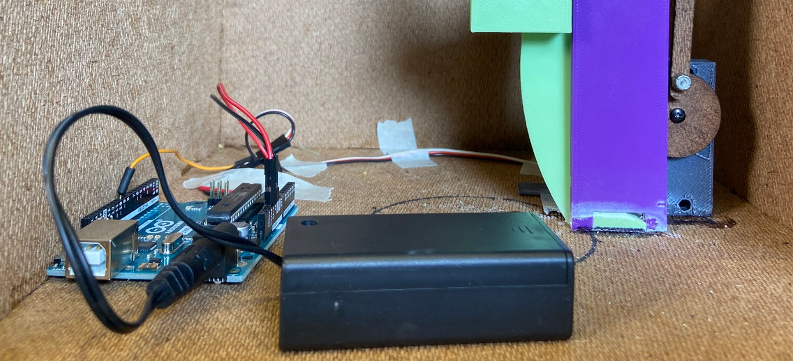
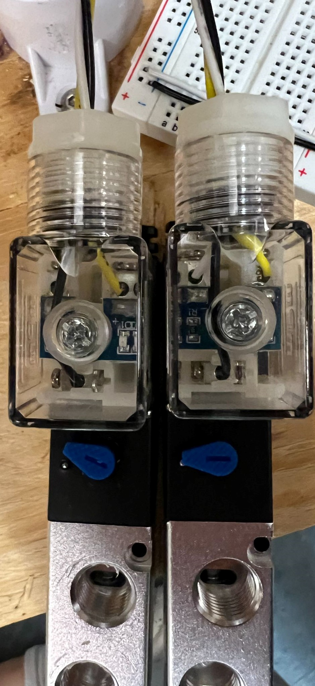
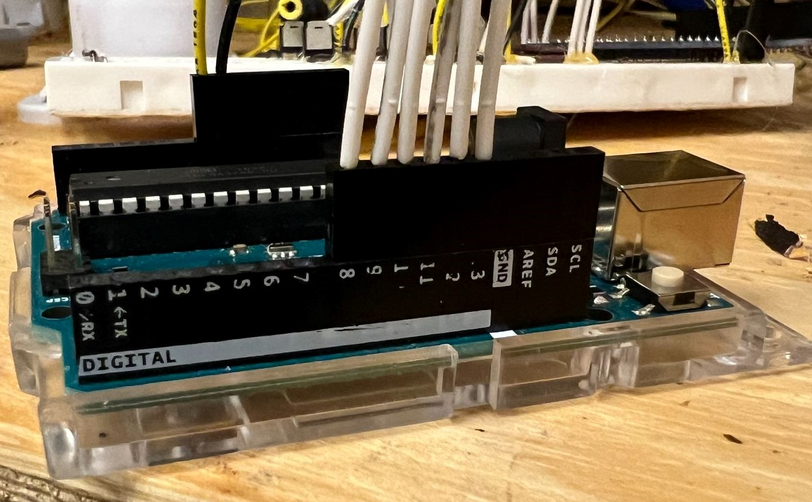
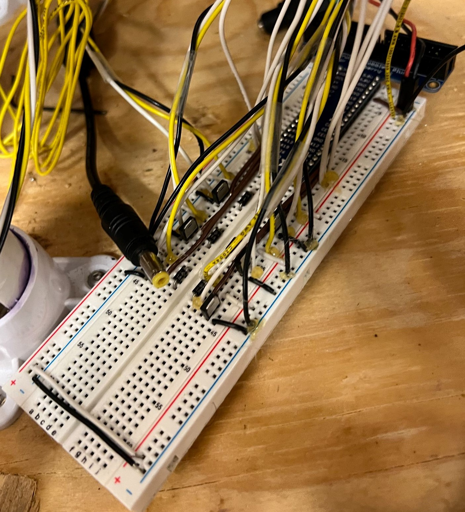

---
title: Whac-A-Mole
layout: template
filename: electrical.md
--- 
[← Back](./index.md) 

## Overall Circuit Overview

The circuit can be broken down into three main steps:

1. The Arduino, for some reason (could be a hit, or it choosing for the mole to go up) chooses to change the state of a mole.
2. The Arduino sends a signal (by setting a pin to high or low) to the MOSFET, turning it on/off and allowing/blocking current flow through the solenoid.
3. The solenoid generates a magnetic field, which moves the plunger in the pneumatic system and causes the mole to pop up through the hole.

As the game continues, the Arduino controls the movement of the moles by turning the MOSFETs on and off. The Arduino will also send data when moles are hit by the player over the serial connection to the Raspberry Pi, which will display the score and other information on the scoreboard.

See the circuit diagram for more information on our wiring.

## Arduino Firmware Overview

The firmware on the Arduino has three main responsibilities:

- Randomly putting moles up and down
- Checking for button presses (when moles are hit), then lowering moles when they're pressed
- Communicating valid hits (button presses when the mole is up) to the Pi, with how long it took for the player to hit the mole

We use one external library: Benoit Blanchon's excellent [ArduinoJSON](https://arduinojson.org/) library.
This allows us to serialize output to the Pi and deserialize input from the Pi.

### The `Mole` Class

In order to do that, we wrote a class that controls a Mole. It has a few fields and methods:

```cpp
class Mole
{
public:
  // pin the mole's solenoid is on
  int solenoidPin;
  // pin the mole's button is on
  int buttonPin;
  // if the mole is up
  bool isUp;
  // when the mole went up
  unsigned long timeUp;
  // how long the mole should be up for
  uint32_t upFor;
  // time until the mole can be pressed / go up
  unsigned long timeout;
  

  /* 
   Create a new mole.
   @param solenoidPin The pin that the mole's solenoid is on.
   @param buttonPin The pin that the mole's button is on.
   */
  Mole(int solenoidPin, int buttonPin);
  bool raiseFor(unsigned long currentTime, int ms); // raise the mole for ms
  bool lowerIfTimePassed(unsigned long time); // lower the mole if it has timed out, returns whether it was lowered
  int lower(unsigned long time); // lower the mole whether it has timed out or not, returns how long it was up for
  void tickTimeout(unsigned long time); // clear the timeout if it has elapsed
  bool timeoutIsActive(unsigned long time); // check whether there is an active timeout
  bool buttonPinIsHigh(); // check whether the mole's button is being pressed

  void print(); // print the mole to the console, useful for debugging
  StaticJsonDocument<64> toJson(); // return a JSON representation of the mole, useful for debugging
};
```

### Setup and Configuration

Some configuration settings are available and static as the code runs:

- `int maxMolesUp` configures the maximum number of moles up at any one time
- `int moleUpTimeBetweenMs[2]` is a tuple containing the minimum and maximum amounts of time in milliseconds that a mole can go up for. Amounts of time are chosen randomly using the first number in the tuple as the lowest possible value and the second number in the tuple as the maximum possible value.
- `bool debug` determines whether the firmware will print debug messages to the console

There are also some settings for the moles that effect gameplay:

- `uint32_t timeout_after_raise` controls how long a mole has to wait before its button being pressed counts as a hit. Since the pneumatics exert so much force on the moles, the buttons often got pressed as they got shot up. This timeout ensures that it's a _player_ hitting the mole, not itself
- `uint32_t timeout_after_hit` controls how long a mole has to wait after it has been hit down to come up again. It ensures that the same mole doesn't just go up, get hit, go down, and go back up immediately. We found that this made the game **far** more fun
- `uint32_t timeout_after_timeup` controls how long a mole waits after it comes down when a player didn't hit it.

A few global variables also hold some state:

- `bool gameRunning` tells whether the game is running: if not, the entire game loop is skipped
- `StaticJsonDocument<64> moleHitDocument` holds a JSON document in memory that we'll change and serialize to efficiently tell the Pi that a mole has been hit
- `Mole *moles[6]` holds instances of all 6 moles, initialized with their solenoid pin and button pin

Finally, the `setup()` function runs which just initializes Serial communication, and sets the Serial timeout to 10ms. It also sets the `moleHitDocument.type` property to `mole_hit`, which will never change.

### The Game Loop

The game loop, which just returns if `gameRunning` is false, has all of the core logic.

1. First, we call the `millis()` function and assign it to a variable. Since we'll use this value many times, we can ensure that the value is always the same throughout a single function run and makes the function more efficient, which is important for reasons we'll discuss later.
2. We run through all moles, and call their `tickTimeout` method with the `time` variable. This ensures that any timeouts that have elapsed are cleared.
3. If the mole is up, we'll also:
    - Lower it, if the player didn't hit it and it's been up for too long. If this happens, we'll set a `didLower` variable to true, which will cause us to skip to the next `loop()` iteration.
    - If the mole is still up (didn't just get lowered), its timeout is **not** active, and its button pin is high, we'll lower the mole by calling `mole->lower(time)`, and tell the Pi that a mole has been hit, with the uptime value returned from the `lower` call.
    - Finally, if the mole isn't currently being pressed, we'll increment a `numMolesUp` variable, which will tell us if we can raise a mole later on.
4. Check if we can raise a mole (if `numMolesUp < maxMolesUp`). If we can:
    - We'll use the `random(0, 6)` function to decide which mole we want to raise
    - If that mole is up or its timeout is active, we'll just return and try again on the next `loop()` iteration
    - Since it's not currently up, we'll choose how long it'll be up before it times out by calling `random(moleUptimeBetweenMs[0], moleUptimeBetweenMs[1])`
    - Finally, we'll call `mole->raise(time, timeToRaise)`, which will raise the mole and set its timeouts

#### Ensuring the Game Loop is Efficient

Since the Uno only supports hardware interrupts on two pins, we can't use them for all six moles. This means we must use `digitalRead()` to check if a button is being pressed, and, since moles are momentarily hit, we need to check really often to ensure that we don't miss a hit.

This means that the game loop must be as efficient as possible. We do this by:

- Using the `millis()` function to get the current time, and storing it in a variable. This ensures that the value is always the same throughout a single function run, and makes the function more efficient
- Only calling `digitalRead()`, a function that takes a non-insignificant time to run, on moles that are up and whose timeout is not active. This ensures that we only check the buttons of moles that are up and whose buttons can be pressed
- Lowering the number of loops through the moles. Even though it's only six moles, if we reduce the number of loops from 4 to 2, we go from 24 to 12 loops per second, which is a 50% increase in efficiency (and we did this!)

### Handling Input from the Pi

We also use the [`serialEvent()` builtin interrupt function](https://docs.arduino.cc/built-in-examples/communication/SerialEvent) to detect Serial input from the Pi. When Serial data is available, this function is automatically called.

Here, we:

1. Check that the input is JSON, and try to decode it. If we can't decode it as JSON, we just print an error and return.
2. Allocate memory for `JsonDocument`s that will hold the output value
3. Read the `.action` property from the decoded input, and perform that action. The following self-explanatory actions are available: `start_game`, `stop_game`, and `get_status`.

Each one allows the game loop (implemented in the Arduino `loop()`) to control the mole.

## Sprint 1

<div style="display:flex;flex-direction:row;justify-content:center;padding:10px">

</div>

In the first sprint, we just reused code and our circuit from Mini Project 2 (servo motor control) to get a servo to go from 0 -> 360 -> 0 on loop. This made our mole go up and down.

## Sprint 2

<div style="display:flex;flex-direction:row;justify-content:center;padding:10px">


</div>

In the second sprint, we made a test circuit for the Arduino that let us test the game logic. It consisted of six buttons (which represented the buttons in the top of the moles) and six LEDs (which represented the state of the moles, up or down) connected with a 10K resistor to the Arduino. This allowed us to work on firmware separate from the mechanical team and we got the game logic largely done here-- we wrote the Mole class, implemented many methods and wrote the first version of the game logic, notably _without_ the timeouts.

We also (and perhaps more importantly) made the solenoid control circuit. We used MOSFETs (electrical gates that control the flow of electricity in a circuit, and they allow a low-voltage device like an Arduino or a Pi to control a higher-voltage device like a 12V solenoid) to let the Arduino control the solenoids.


## Sprint 3

<div style="display:flex;flex-direction:row;justify-content:center;padding:10px">



</div>

In the third sprint of the project, we:

- Wired up all the solenoids with color-coded wires with matching lengths (leftmost picture)
- Used PIE-provided pin headers to connect the Arduino to the solenoids and the buttons in the top of the moles (second picture)
- Set up the Arduino to be powered by the 12V solenoid power supply (the Uno `Vin` pin accepts between 7-12V!) (not pictured)
- Wired up the buttons inside the moles to a separate breadboard (not pictured), which put a 10K resistor between the button and the Arduino's pin, and connected the Arduino's pin to ground, therefore keeping the pin Low until the button is pressed, at which point the pin goes High
- Hot glued the solenoid wires to the breadboard-- **you shouldn't do this! Use an Arduino protoshield!** (third picture). We did this because we switched from having the Pi control the solenoids to having the Arduino control them, and we didn't have time to solder the wires to the protoshield
- Got the Arduino to control the solenoids and the buttons in the top of the moles (not pictured)

## Final Sprint

In the final sprint of the project, we focused on playtesting and adjusting the code.

As we played, it became clear that, since there was about a 1/4 chance for each mole to go up, the same moles were going up over and over again. We spent a bunch of time creating the timeout system that kept moles down for a certain amount of time after they were hit, and this made the game _significantly_ more fun, when the timeouts were right, and we found the right values with trial-and-error.

We also somewhat merged with the software team to ensure that the Serial output from the Arduino was in the correct format for the Pi to read, and we helped them work on the software to ensure we had a fully functional game on demo day, which we did!

Finally, we went back to the game loop and optimized the software. This helped ensure that almost all mole hits registered and that the game loop ran at a consistent speed.