---
title: Whac-A-Mole
layout: template
filename: mechanical.md
--- 
[← Back](./index.md) 

# Mechanical Systems Breakdown

## Sprint 1

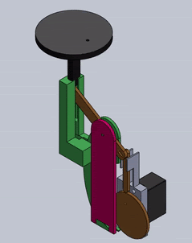
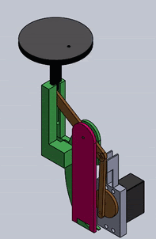

For the first sprint, we wanted to create a proof of concept. We had a cam system connected to a bar-linkage that made one mole go up and down. A lot of our parts were made of PLA (3d printed) and fiberboard (laser cut). 

## Sprint 2

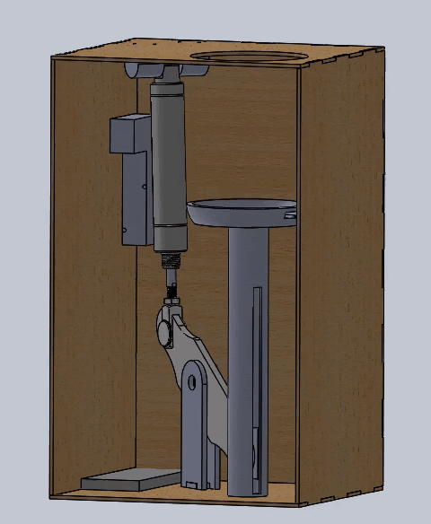
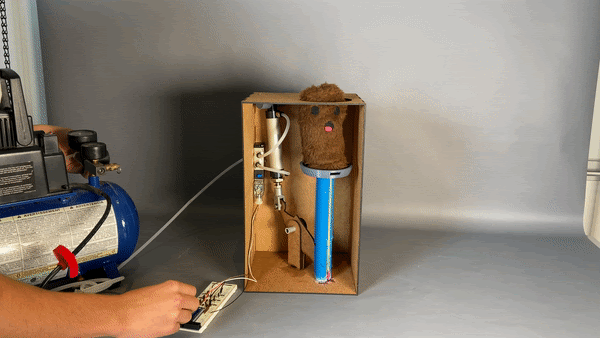

For Sprint 2, we hooked up one pneumatic piston that made one mole go up and down with a larger linkage system. The pneumatic piston was connected to a solenoid, which controlled whether pressurized air or atmospheric air was in the system, causing the mole to shoot up or fall down. This sprint taught us to rely less on glue and to use utilize more screws in the final designs for more durability and robustness.

## Sprint 3

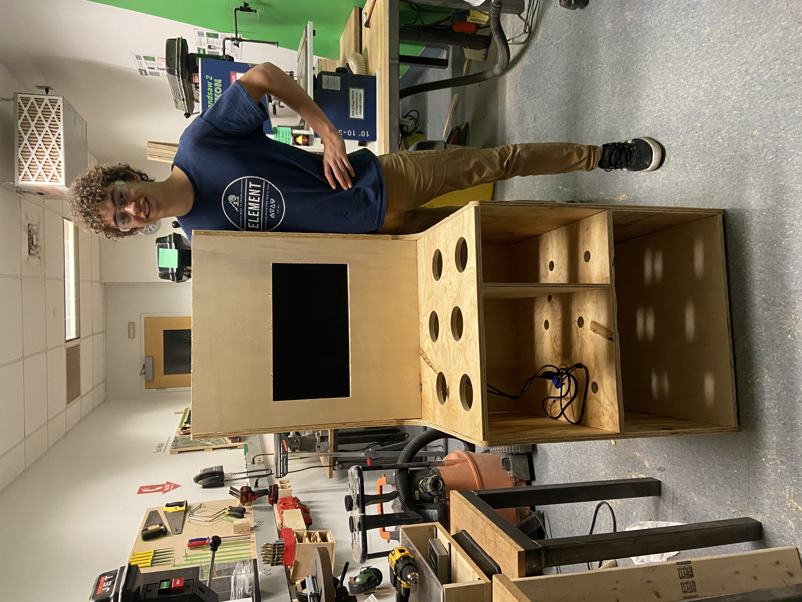

In sprint 3, we dramatically scaled up the system. We got three moles moving up and down using the pneumatic system, air compressor, and solenoids. We also created a realistic arcade cabinet structure, with a monitor built-in! This gives players the feeling that they are at a real arcade!

Since sustainability is important to us, we only 3-D printed one piece: a part that connected the solenoids to the mole shafts. We also didn't use any glue in the  mechanical system since we want to take the entire thing apart at the end of the project to allow others to use our scrap wood and other parts. This minimized waste and let future PIE-ers use our parts for use in their projects!

## Final Sprint

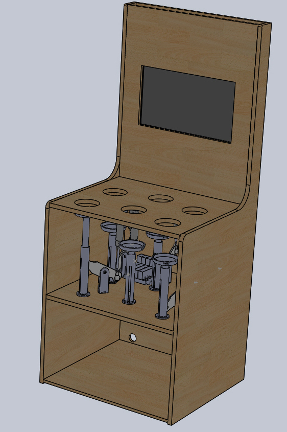

For the final sprint, we connected six moles to the pneumatic system. With the offset linkage, we were able to eliminate damage to the pneumatics as they would get damaged if torque was applied to the solenoid shaft, which might realistically happen if a player hit a mole at an angle.

At the end, the system looked like a real arcade game, and it was satisfying to see a finished product we were proud of. 

# Moles System Breakdown

## Mole Design Breakdown

The mole in the first sprint was simply a stuffed animal created from scrap fabric. This design was mainly to test if making a stuffed animal would help reduce the force on the pneumatic system by absorbing some of it when it compressed. Although the first mole didn’t have any special features, it provided proof of concept.

   

First Mole and Hammer

In the second sprint, a button was added to the top of the second mole. When the first mole was made, we originally thought that we would incorporate some kind of button underneath it, however this design seemed to be impractical as we could only find small buttons that met our needs, meaning the player would have to be very precise to hit the button. To address this issue, we designed a button holder that could be sewn to the top of the mole.

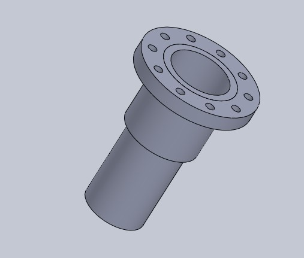

Button Holster

This holster was then attached to the top of the mole shown in sprint 2. This design, however, still didn’t solve the issue that a player had to be very precise with their hits in order to get points.

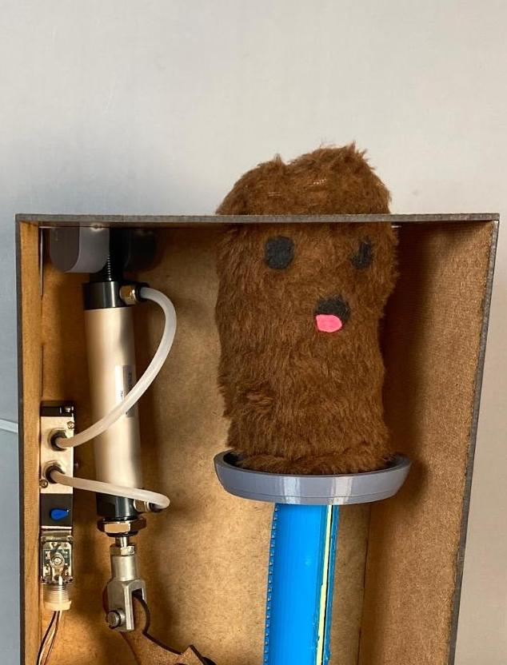

Second Mole (Sprint 2)

To specifically address this issue, we designed a system that would allow a button to be pressed from anywhere on the top of the mole’s head. At first, we didn’t have many solutions, and then out of nowhere, we thought: "Why not use ball pit balls?" Honestly, I don’t remember where that thought came from, but it as a game changer.

We called a place with a ball pit called [Jam Time](https://www.jamtime.com), and asked if we could use some of their balls for a college project. They said yes, and the whole team went to pick them up-- it made for some fantastic team bonding! Although we originally thought that we only needed 3 (since only a half of a ball would go in each mole's head), Jam Time kindly gave us 8. The first design incorporating the balls didn’t work as it only used half the ball. Instead of letting the shell that the half the ball created move freely, the stuffing inside the mole stopped it from moving. This design didn’t work at all and the button wouldn’t press.

The next attempt was closer to the final version. It involved both halves of the balls being stacked on top of each other. The top one attached to the top of the mole as well as the button, while the bottom sat freely with stuffing underneath it. This worked slightly better than the first, but the more it was hit, the more the bottom piece moved around and no longer supported the button’s holster. 

To fix the movement, we used hot glue to attach the holster to the ball. The hot glue allowed the two pieces to melt slightly and connect well. 

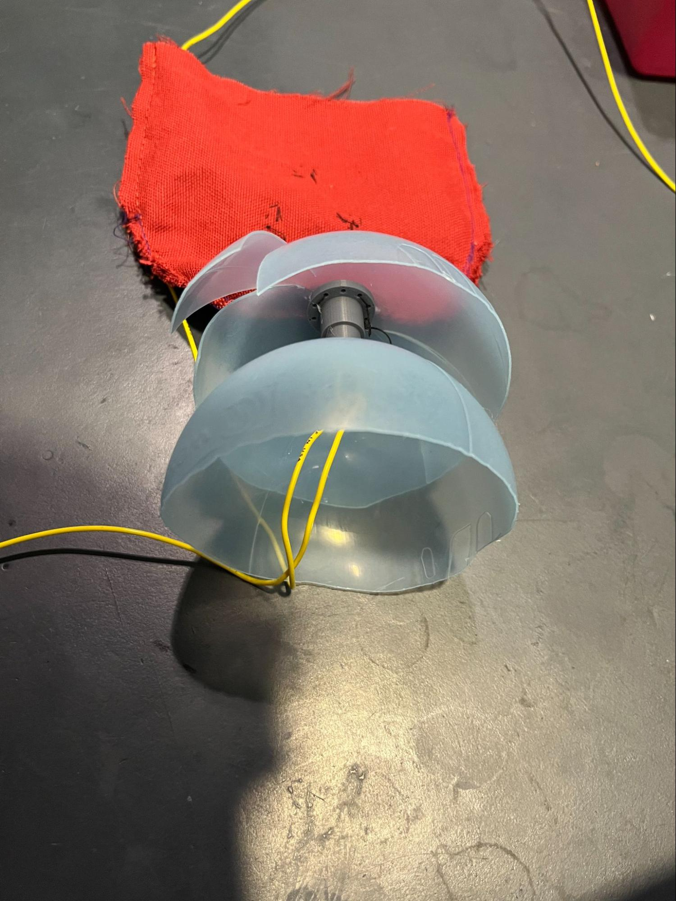
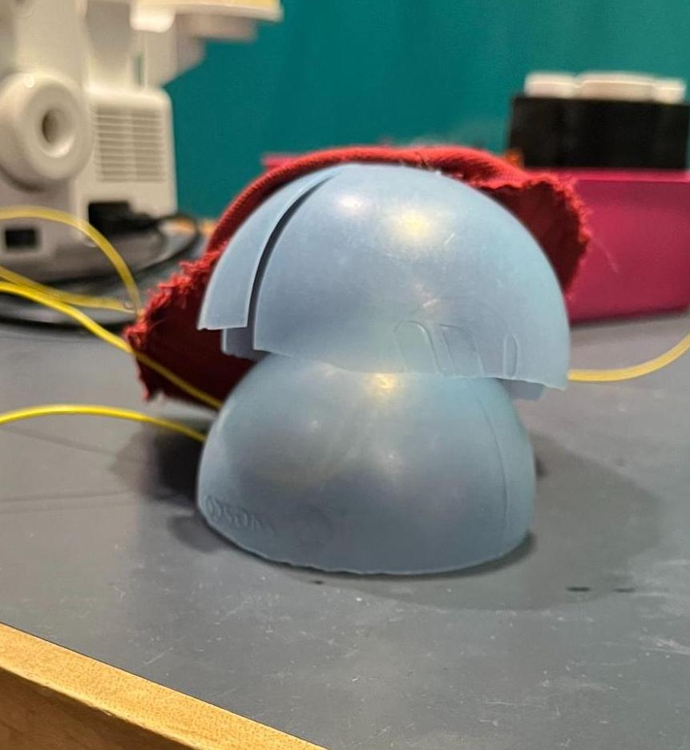
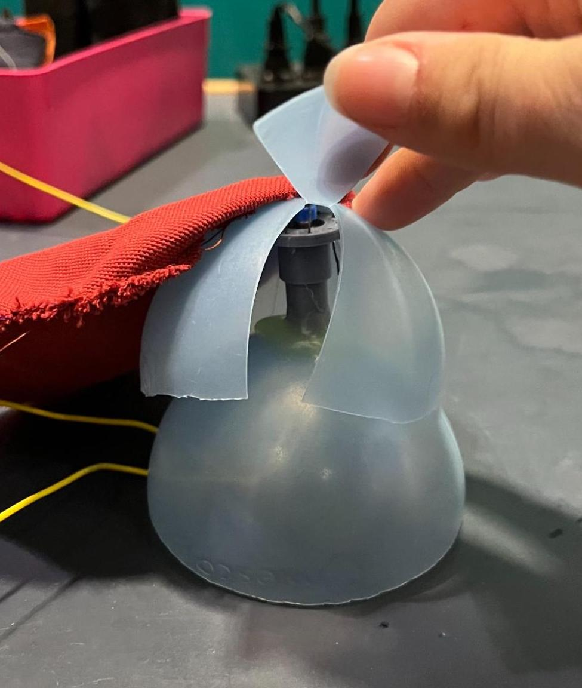

The final button-ball system. Here the mole is flipped inside out, so the system is visible.
   

Once the system was fully operational, we completed all 6 moles and sewed them onto the system itself. Each pneumatic system had a plate with a bunch of holes so we could easily sew the mole to it.

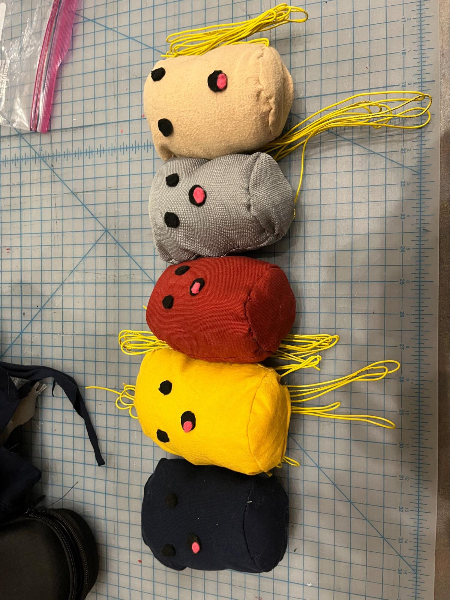

5 out of 6 moles before they were attached to the overall system

As we play-tested, the moles began to slightly fall apart. This happened because the upholstery thread that held the button at the top broke. With nothing holding it in place, the button moved around until it was no longer under the ball’s shell. The other common problem was the wires disconnecting from the buttons. We’re not sure why, but the soldering sometimes came off or the wires just broke.

If those issues occurred, the mole could only be fixed by being taken apart. Overall, the design held up well as only two of the moles broke after about two hours of people smashing them on top of previous play-testing.
