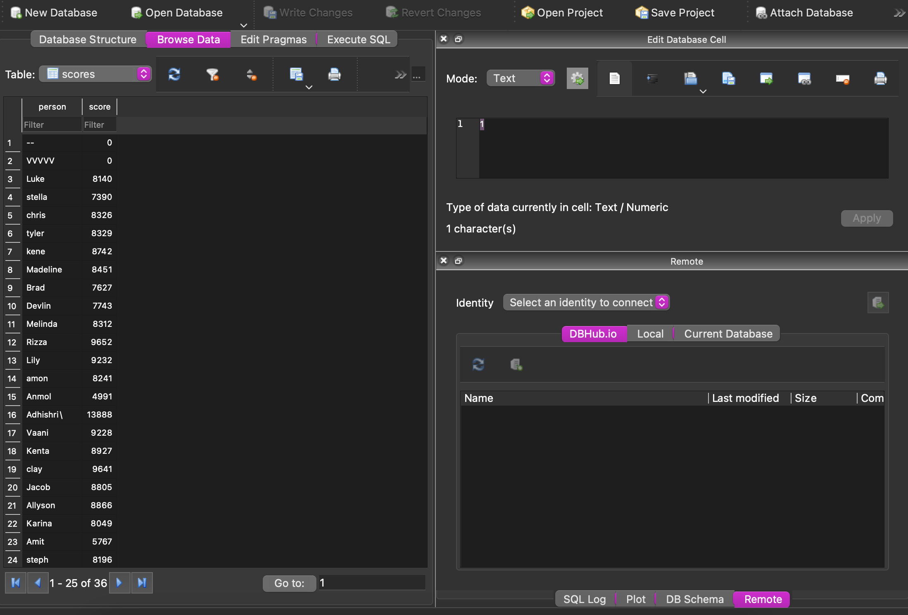

---
title: Whac-A-Mole
layout: template
filename: software.md
--- 
[← Back](./index.md) 

# Software System Breakdown

## Sprint 1

The first sprint of the project was focused on setting up the React frontend for the website and connecting it to a websocket hosted on a python Flask server. To test it, we sent a score update every second from the python server, which is displayed in the GIF above. We chose to use Flask with python since it can be easily integrated with PySerial in the future to communicate with the Arduino.

## Sprint 2

In the second sprint, we created the various components for the game, such as the player name input, score display and the leaderboard. We used React's component approach to make it easy to reuse these components throughout the website. We also added state to the website to keep track of the player's score, game state and refresh the leaderboard everytime it is updated from a websocket call. Using Styled-Components in React we were also able to add a smooth CSS animation at the top of the website. The second sprint was focused on getting comfortable with React and setting up functionality to integrate game state updates from the Flask backend.

## Sprint 3

In the third sprint of the project, we finished add more functionality to the Flask backend including writing to a SQlite database for leaderboard updates and connecting it to PySerial. The Flask backend reads from the Arudino serial output to receive information about when a mole was hit and how long it stayed up. It uses that information to calculate a score and assigns it to the current player, which is received from user input in the React frontend. It continuously reads from the serial output and send updates for the score display and writes a final score to the SQlite database when the game ends. The leaderboard is refreshed by sending an update to the React frontned at the end of the game. The SQlite database also implements features like only updating the leaderboard score of a player if it is higher than the previous score from their last played game. The leaderboard was one of the most important features of the project adding another layer of interactivity which people enjoyed a lot on demo day.

## Final Sprint

In the final sprint we implemented final feature like a game countdown and a "Game Started!" and "Game Over!" banner. There were also quite a few expected bug fixes like score not resetting to zero and websocket time out issues. These were discovered during play testing and after a multiple hours of debugging the game was running smoother than the CSS animations. We also added some quality of life features like resetting the leaderboard when a correct password is entered after a "/" in the player name input. The final result was a beautiful website which added onto our amazing electrical and mechanical systems stitching everything together into an a fully functional arcade game.

### External Software dependencies:   
Python:   
- [PySerial](https://pypi.org/project/pyserial/)
- [Flask-Sock](https://flask-sock.readthedocs.io/en/latest/)
- [Flask](https://flask.palletsprojects.com/en/2.2.x/)
- [numpy](https://numpy.org)
- [sqlite3](https://docs.python.org/3/library/sqlite3.html)   

ReactJS:   
- [react-use-websocket](https://www.npmjs.com/package/react-use-websocket)
- [react-countdown](https://www.npmjs.com/package/react-countdown)
- [styled-components](https://styled-components.com)
